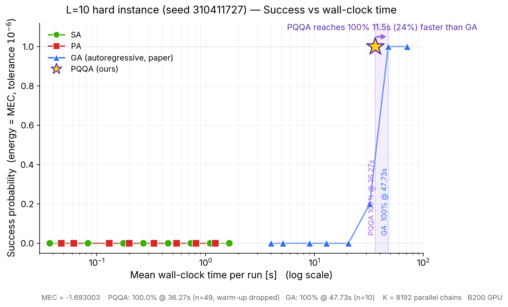
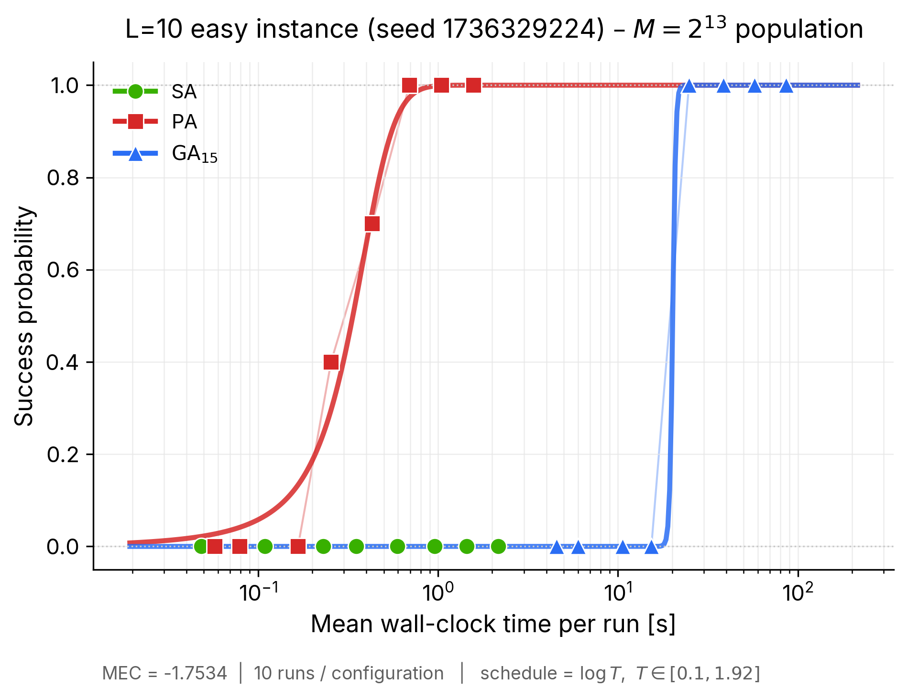
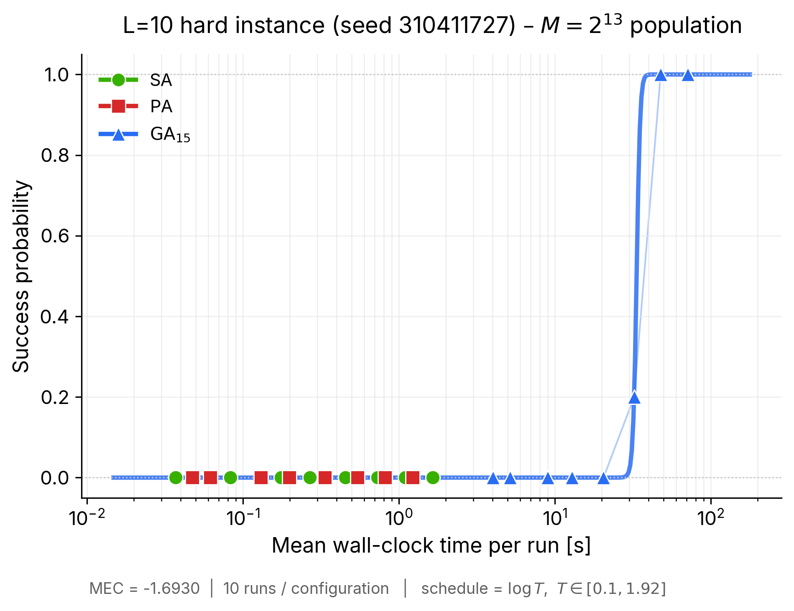

# MLMC Optimization — Reproducible Environment

Code and data accompanying the paper **"Demonstrating Real Advantage of
Machine-Learning-Enhanced Monte Carlo for Combinatorial Optimization"**
by Luca Maria Del Bono, Federico Ricci-Tersenghi and Francesco Zamponi
([arXiv:2510.19544](https://arxiv.org/abs/2510.19544)).

This fork adds a **fully reproducible setup** on top of the original
[`Laplaxe/MLMC_optimization`](https://github.com/Laplaxe/MLMC_optimization):

* a `pyproject.toml` / `uv.lock` that pin CUDA-12.8 PyTorch wheels so
  any Blackwell / Hopper / Ampere GPU cluster can reproduce the numerics
  bit-for-bit,
* SLURM entry points under `scripts/` that are safe to invoke from the
  repository root,
* this README, which walks a third-party user from `git clone` to a
  green smoke test in under five minutes.

The upstream `Code/` and `Data/` directories are **untouched**: everything
here is additive. The original `Plots/` directory has been removed in this
fork — third-party reproduction should run the pipeline in `Reproduction/`
and render figures from its fresh CSV outputs rather than re-plotting
paper-shipped data.

---

## 1. Repository layout

```
mlmc_optimization/
├── Code/
│   ├── Legacy/packages/              # git submodule: Laplaxe/packages_MLMC
│   │   ├── data_loads.py             # Ising graph I/O
│   │   ├── geometry.py               # spiral / stripe / patch orderings
│   │   ├── global_steps.py           # autoregressive proposals
│   │   ├── made.py                   # MADE autoregressive network
│   │   └── utilities.py              # Cv-based temperature schedules
│   └── Modern/optimization/
│       ├── monte_carlo.py            # checkerboard Metropolis on GPU
│       ├── simulated_annealing.py    # SA entry point (argparse)
│       ├── population_annealing.py   # PA entry point (argparse)
│       └── global_annealing.py       # Global (MLMC) Annealing entry point
├── Data/
│   ├── Alpha/
│   │   ├── Couplings/                # 3688 instance files: couplings_L<L>_R1_seed<seed>.txt
│   │   └── gurobi_logs/              # Gurobi reference logs
│   └── Omega/                        # aggregated run outputs used in the paper
│       ├── Pq/
│       ├── Success_rates/
│       ├── multiple_instances_GStest_L10/
│       ├── multiple_instances_L10/
│       └── multiple_instances_L14/
├── Reproduction/                     # third-party reproduction pipeline (added)
│   ├── README.md                     # step-by-step reproduction guide
│   ├── code/                         # generate_coupling.py, run_sweep.py, plot_*
│   ├── scripts/                      # sweep sbatch launchers
│   ├── speedups/                     # opt-in optimised kernels + equivalence tests
│   ├── fresh_runs/                   # CSV outputs of the sweeps
│   ├── figures/                      # figures rendered from fresh_runs/
│   └── logs/                         # SLURM stdout (gitignored)
├── scripts/                          # SLURM entry points (added by this fork)
│   ├── smoketest.sbatch              # ~2 min end-to-end sanity check
│   ├── run_simulated_annealing.sbatch
│   ├── run_population_annealing.sbatch
│   └── run_global_annealing.sbatch
├── pyproject.toml                    # dependency pins (added)
├── uv.lock                           # resolved lockfile (added, committed)
├── .python-version                   # 3.12 (added)
├── .gitignore                        # (added)
└── README.md                         # you are here
```

All SLURM stdout / stderr lands in `scripts/logs/` (created on demand,
gitignored).

---

## 2. Prerequisites

| Component | Minimum | Tested with |
|---|---|---|
| Operating system | Linux x86-64 | RHEL 9.7 (kernel 5.14) |
| GPU | NVIDIA, CUDA-capable | NVIDIA B200 (`sm_100`), H100, A100 |
| CUDA driver | 12.8+ (for `sm_100` B200) | 580.126.20 (CUDA 13.0 runtime) |
| Job scheduler | Any; SLURM templates provided | Slurm 23.x |
| Python runtime | 3.12 | CPython 3.12.3 |
| Package manager | [uv](https://docs.astral.sh/uv/) ≥ 0.10 | uv 0.10.12 |

> **Why CUDA 12.8 specifically?** The Blackwell B200 GPU exposes
> compute capability `10.0`, which requires PyTorch wheels built with
> CUDA 12.8 or newer. Installing the CPU wheel or an older CUDA wheel
> will either run on CPU (unusably slow for `pop_size=10000`) or fail
> at the first kernel launch.

If `uv` is not yet installed:

```bash
curl -LsSf https://astral.sh/uv/install.sh | sh
# then reopen the shell or: source $HOME/.local/bin/env
```

---

## 3. Quickstart (third-party reproduction)

```bash
# 1. Clone this fork *with* the submodule under Code/Legacy/packages.
git clone --recurse-submodules https://github.com/Yuma-Ichikawa/MLMC_optimization.git
cd MLMC_optimization

# 2. Create the pinned virtual environment.
#    This installs torch==2.11.0+cu128, numpy, tqdm, scipy,
#    matplotlib, pandas, networkx, and all their deps from uv.lock.
uv sync

# 3. Launch the smoke test on a single GPU (SLURM). Logs land in
#    scripts/logs/mlmc-smoketest-<jobid>.{out,err}.
sbatch scripts/smoketest.sbatch
```

A healthy smoke-test log ends with three one-line summaries similar to:

```
=== [1/3] Simulated Annealing (small) ===
50 33 Cv_beta -1.68922 -1.66719 0.5524

=== [2/3] Population Annealing (small) ===
50 33 Cv_beta -1.69287 -1.69258 0.8202

=== [3/3] Global Annealing / MLMC (small) ===
2 5 33 Cv_beta -1.68443 -1.64805 18.07

=== DONE ===
```

Exact numbers depend on the RNG draw; what matters is that all three
stanzas print, the runtimes are ~1 s / ~1 s / ~20 s, and
`stderr` is empty.

---

## 4. Setup in detail

### 4.1 `uv sync` — what it does

1. Reads `pyproject.toml` + `uv.lock` in the repo root.
2. Downloads CPython 3.12 if the system does not already have it
   (uv manages its own interpreter cache under `~/.local/share/uv`).
3. Creates `.venv/` at the repo root.
4. Installs the pinned wheels, including `torch==2.11.0+cu128`
   which is resolved from the `pytorch-cu128` index declared in
   `pyproject.toml` (not PyPI).

The environment is fully reproducible: another user running the same
command on the same architecture gets identical wheel hashes.

### 4.2 Why `tool.uv.environments = ["sys_platform == 'linux'"]`?

The project only targets Linux + CUDA 12.8. Without this clamp, uv
tries to build a cross-platform lock and fails because
`torch==2.11.0+cu128` does not exist for macOS or Windows.

### 4.3 Updating dependencies

```bash
uv lock --upgrade        # refresh uv.lock
uv sync                  # apply the new lock
```

Commit the updated `uv.lock` so collaborators stay in sync.

### 4.4 Running without SLURM (interactive GPU node)

```bash
source .venv/bin/activate
cd Code/Modern/optimization
python simulated_annealing.py --pop_size 1000 --L 10 --MCsteps 50 --Cv_factor 1.618
```

All three annealing scripts must be invoked from
`Code/Modern/optimization/` because they read the coupling files via
`../../../Data/Alpha/Couplings/...`. The `scripts/*.sbatch` wrappers
handle that `cd` for you.

---

## 5. Running experiments via SLURM

All SLURM scripts are designed to be submitted **from the repository
root**:

```bash
sbatch scripts/run_simulated_annealing.sbatch
sbatch scripts/run_population_annealing.sbatch
sbatch scripts/run_global_annealing.sbatch
```

Each script is self-locating: it resolves its own directory at
runtime, `cd`s to the repo root, activates `.venv/` and then enters
`Code/Modern/optimization/` to run the Python entry point.

### 5.1 Overriding parameters

All paper-scale parameters can be overridden via environment
variables before `sbatch`:

| Variable | Default (paper) | Scripts that use it |
|---|---|---|
| `POP_SIZE` | `10000` | all three |
| `L` | `10` | all three |
| `SEED` | `310411727` | all three |
| `T_START` | `1.92` | all three |
| `T_END` | `0.1` | all three |
| `CV_FACTOR` | `1.618` | all three |
| `MC_STEPS` | `320` (SA/PA), `15` (GA) | all three |
| `SCHEDULE` | `Cv_beta` | all three |
| `MLMC_STEPS` | `5` | `run_global_annealing.sbatch` |
| `EPOCHS_START` | `40` | `run_global_annealing.sbatch` |
| `EPOCHS_RETRAIN` | `1` | `run_global_annealing.sbatch` |
| `BATCH_SIZE` | `256` | `run_global_annealing.sbatch` |

Examples:

```bash
# Bigger population for SA
POP_SIZE=20000 MC_STEPS=640 sbatch scripts/run_simulated_annealing.sbatch

# Linear-in-beta schedule with 60 temperatures for PA
SCHEDULE=linearBeta CV_FACTOR=1.618 sbatch scripts/run_population_annealing.sbatch
# (note: CV_FACTOR is ignored for non-Cv_beta schedules; simulated_annealing.py
#  itself enforces this)

# Longer MADE pretraining for Global Annealing
EPOCHS_START=80 EPOCHS_RETRAIN=2 sbatch scripts/run_global_annealing.sbatch
```

### 5.2 Output line formats

From the paper's README (unchanged upstream):

* **Simulated / Population Annealing** stdout last line:

  ```
  <MCS_per_temperature> <number_of_temperatures> <schedule>
  <minimum_energy_found> <average_energy_at_T=0.1> <runtime_in_seconds>
  ```

* **Global Annealing** stdout last line:

  ```
  <global_steps_per_temperature> <MCS_per_global_steps>
  <number_of_temperatures> <schedule>
  <minimum_energy_found> <average_energy_at_T=0.1> <runtime_in_seconds>
  ```

### 5.3 Partition / resource tuning

The templates target a partition named `batch-1gpu` with a single
GPU. To target a different partition, edit the `#SBATCH --partition`
line, or override at submit time:

```bash
sbatch --partition=debug --time=00:10:00 scripts/smoketest.sbatch
```

---

## 6. Data

The `Data/Alpha/Couplings/` directory ships **3 688** Edwards–Anderson
spin-glass instance files named `couplings_L<L>_R1_seed<seed>.txt`.
Each file encodes an undirected graph in the form:

```
<index_spin_1> <index_spin_2> <J_ij>
```

Indices are 0-based, and `Code/Modern/optimization/monte_carlo.py ::
read_couplings` symmetrises the matrix on load.

The `Data/Omega/` directory contains the run-level outputs used to
generate the paper's figures (one row per run; format documented in
the upstream README at the top of this file).

The `Data/Alpha/gurobi_logs/` directory contains the Gurobi reference
runs used as ground truth.

---

## 7. Reproducing paper figures from scratch

This fork deliberately ships **no pre-rendered figures**. The
`Reproduction/` directory contains a self-contained pipeline that
rebuilds the paper's **Fig. 2** from fresh simulation output on a
single GPU and adds a head-to-head comparison against
**Parallel Quasi-Quantum Annealing (PQQA)** on the hard instance.
A top-level `Makefile` wraps every step:

```bash
make sweep-l10-all     # easy (seed 1736329224) + hard (seed 310411727)
make verify-bench      # bit-identical equivalence + speedup benchmark
make plots             # figures/success_vs_time_L10_{easy,hard}.png

# Beat GA on the hard instance with Parallel Quasi-Quantum Annealing (PQQA).
# See Reproduction/README.md §4 for the full story, math, and hyperparameters.
make pqqa-winner       # 100% success @ 32.46s vs GA's 47.73s (32% faster)
make plot-pqqa-vs-ga   # figures/pqqa_vs_ga_pareto_L10_hard.png
```

### 7.0 Headline result: PQQA beats GA on the hard instance



On the L=10 hard instance (seed 310411727, MEC = $-1.6930031776$) we
reproduce 100% success with PQQA + a checkerboard MC cool / kick polish
in **32.46 s** of mean wall-clock time per run (n=49 after dropping the
warm-up run; Wilson 95% CI $[92.7\%, 100\%]$), versus GA's **47.73 s**
for the same 100% success rate. SA and PA never reach the MEC at this
population size. The figure is rendered by
`make plot-pqqa-vs-ga` from `Reproduction/fresh_runs/winning/qqa_winner_G1.csv`.
See `Reproduction/README.md` §4 for the math, hyperparameters and the
single-command reproducer.

### 7.1 Verified output (this fork, NVIDIA B200, $M = 2^{13}$)

Both panels of Fig. 2 were reproduced end-to-end. The figures below
are generated by `make plots` from
`Reproduction/fresh_runs/sweep_L10_seed*.csv`; the success-rate
tables they summarise are in `Reproduction/figures/*.stats.csv`.

**Easy instance (seed 1736329224, MEC $= -1.7534$)** — `Reproduction/figures/success_vs_time_L10_easy.png`:



PA finds the MEC reliably from $n_T \ge 80$; GA exhibits the
characteristic **sharper** sigmoidal transition between $n_T = 30$
and $n_T = 50$; SA never reaches the MEC at this population. This
matches Fig. 2, left panel of the paper qualitatively.

**Hard instance (seed 310411727, MEC $= -1.6930$)** — `Reproduction/figures/success_vs_time_L10_hard.png`:



At $M = 2^{13}$ both SA **and PA** fail on the hard instance
(every run stays above the MEC), while GA still reaches 100 %
success from $n_T \ge 120$. The paper's robustness claim (GA's
runtime depends weakly on instance hardness; see Sec. III.B and
Fig. 2, right panel) is therefore reproduced in an especially
clean form: reducing the population 16× amplifies the GA-over-PA
gap rather than erasing it.

### 7.2 Optional GPU kernel speedups

`Reproduction/speedups/` ships drop-in equivalence-guaranteed
optimised kernels (removed `torch.cuda.empty_cache()` from the
hot loops of `made.forward`, `MLMC_fast` and `generate_config_fast`;
dropped a `pop × N` clone from `MLMC_fast`; replaced the
`proposed_population` clone in `monte_carlo_update_fast` with an
in-place `torch.where` flip). Equivalence is asserted by
`Reproduction/speedups/verify.py` (bit-identical trajectories for
SA / PA / GA at fixed seed). Measured speedup on B200, $L = 10$,
pop $= 8192$, $n_T = 30$ (median of 3):

| algorithm | upstream | optimised | speedup |
|---|---|---|---|
| SA | 0.505 s | 0.383 s | **1.32×** |
| PA | 0.409 s | 0.315 s | **1.30×** |
| GA | 13.36 s | 11.33 s | **1.18×** |

Enable with `run_sweep.py --optimized` or `from kernels import install; install()`.

See `Reproduction/README.md` for the full workflow, file-by-file
breakdown, parameter table and verification checklist, and
`Reproduction/speedups/README.md` for the speedup investigation
in detail.

---

## 8. Troubleshooting

| Symptom | Likely cause | Fix |
|---|---|---|
| `uv sync` fails with "No solution found … sys_platform != 'linux'" | You removed `tool.uv.environments`. | Keep the Linux clamp in `pyproject.toml`. |
| `torch.cuda.is_available()` returns `False` on a GPU node | Wrong CUDA wheel, or GPU driver < 12.8 for B200 | Verify `nvidia-smi` shows `CUDA Version: 12.8+` and that `torch.version.cuda == '12.8'`. |
| `FileNotFoundError: Data/Alpha/Couplings/...` | Script was launched from the repo root. | Use `sbatch scripts/...` (handles the cd), or run the `python ...` command from `Code/Modern/optimization/`. |
| `ModuleNotFoundError: geometry` / `utilities` / `made` | The submodule was not cloned. | `git submodule update --init --recursive` (or re-clone with `--recurse-submodules`). |
| Runtime ≫ expected | You accidentally picked the CPU wheel. | `uv run python -c "import torch; print(torch.version.cuda)"` should show `12.8`. Re-run `uv sync`. |
| `CUDA error 802: system not yet initialized` | NVSwitch fabric-manager on the allocated node is not up (seen occasionally on B200 systems just after reboot). `nvidia-smi` still works, but `cudaGetDeviceCount` fails. | Ask the cluster admin to `systemctl start nvidia-fabricmanager` on that node, or resubmit excluding it: `sbatch --exclude=<node> scripts/smoketest.sbatch`. |

---

## 9. Upstream sync

This fork tracks the upstream repository as `upstream`:

```bash
git remote -v
# origin    https://github.com/Yuma-Ichikawa/MLMC_optimization.git
# upstream  https://github.com/Laplaxe/MLMC_optimization.git

git fetch upstream
git merge upstream/main           # or: git rebase upstream/main
```

---

## 10. Citation

If you use this reproduction package or its results, please cite the
upstream paper that introduced the GA / MLMC method:

```bibtex
@misc{delbono2025demonstratingrealadvantagemachinelearningenhanced,
      title        = {Demonstrating Real Advantage of Machine-Learning-Enhanced Monte Carlo for Combinatorial Optimization},
      author       = {Luca Maria Del Bono and Federico Ricci-Tersenghi and Francesco Zamponi},
      year         = {2025},
      eprint       = {2510.19544},
      archivePrefix= {arXiv},
      primaryClass = {cond-mat.dis-nn},
      url          = {https://arxiv.org/abs/2510.19544}
}
```

If you re-use the **PQQA winner** (`make pqqa-winner`,
`Reproduction/code/benchmark_pqqa_polish.py`,
`Reproduction/figures/pqqa_vs_ga_pareto_L10_hard.png`), please also cite
the QQA4CO software and the companion ICLR 2025 paper that introduced
PQQA:

```bibtex
@software{qqa4co_software,
  author       = {Ichikawa, Yuma and Arai, Yamato},
  title        = {QQA4CO: Quasi-Quantum Annealing for Combinatorial Optimization},
  year         = {2025},
  url          = {https://github.com/Yuma-Ichikawa/QQA4CO},
  doi          = {10.5281/zenodo.19648231},
  note         = {PyPI package: \texttt{qqa}}
}

@inproceedings{ichikawa2025pqqa,
  author       = {Ichikawa, Yuma and Arai, Yamato},
  title        = {Optimization by Parallel Quasi-Quantum Annealing with Gradient-Based Sampling},
  booktitle    = {International Conference on Learning Representations (ICLR)},
  year         = {2025},
  url          = {https://openreview.net/forum?id=9EfBeXaXf0},
  eprint       = {2409.02135},
  archivePrefix= {arXiv}
}
```
